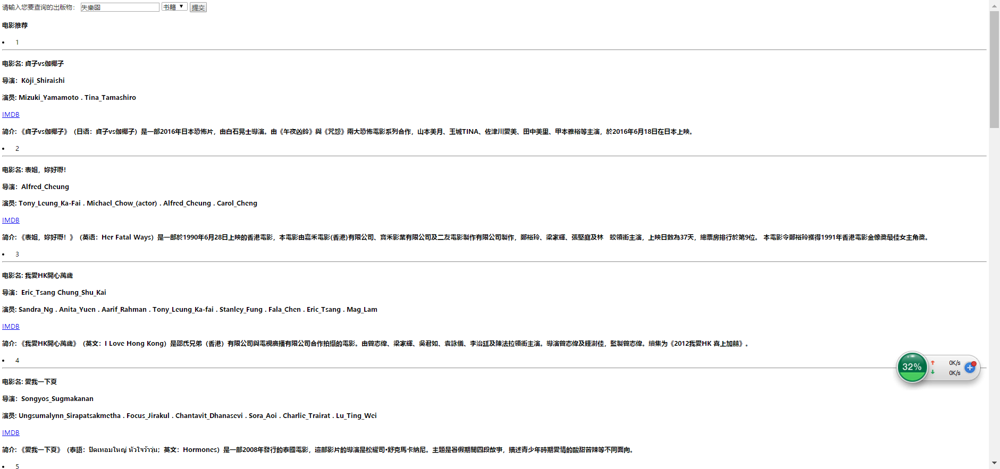

# 知识工程大作业

[TOC]

 

## 一、任务目标

- [x] 实现一个基于知识图谱的出版物(电影、图书、游戏)检索和推荐系统
- [x]   知识图谱基于 DBpedia、IMDb等链接开放数据
- [x]   实现出版物的检索功能,能够直接检索到相关出版物的基本信息,并给出相关介绍网页的链接
- [x]   实现出版物语义推荐的功能,基于知识图谱给出的语义,推荐用户可能感兴趣的其他出版物
- [x]   实现对出版物相关数据的可视化分析与展示
- [x]   所有源码上传到 Github上
- [x] 附上系统的分析设计思路,功能描述,使用说明等文档

## 二、设计思路

​       由于本门课程是知识工程基础，我们开始的打算是先利用IMDB和DBpedia在本地融合构建一个图谱，但受限于水平、时间以及本地的存储在尝试了一天，放弃了构建图谱的这一任务，转而采用了DBpedia的一个endpoint。

​        由于本任务是出版物的推荐，没有必要做搜索关键词的分词及意图分析，所以我直接使用原始的搜索题去DBpedia进行查询，利用sparqlwrapper去调用endpoint得到搜索结果。

​        在所有任务中我们花的时间最多的是在出版物的推荐上面，主要有三部分构成：出版物冷启动推荐、知识库搜索推荐、出版物内容embedding推荐。出版物的冷启动我们采用的是统计热门作品，在其中选择固定数量的推荐结果放入推荐栏位当中。知识库搜索推荐利用用户看过的作品集合返回相应的作品信息，选取出现频率较高的部分关键信息进行二次搜索，例如电影推荐利用的是用户看过的电影的主演、导演中出现频率最高的几项成为二次搜索的关键词，返回待推荐集合。基于内容的推荐，我们首先把名称和摘要切词，之后利用微信的word2vec得到名称和摘要的embedding取平均，和其它的电影的emebedding信息做预先相似度，取最高的N个电影也成为待推荐的电影集合。把前面两个待推荐集合混合起来，随机抽取5个作品，放入首页推荐展示栏位。

## 三、功能描述

### 3.1 搜索功能

​        通过用户查询的关键词实现了查询相关出版物的基本信息、提供了网页介绍（其实电影部分提供了IMDB的网址）

### 3.2 推荐功能

​        推荐的逻辑是通过用户曾经看过的历史作品来推荐相关的作品内容。

主要有三部分组成：冷启动、知识图谱推荐、作品embedding相似度推荐(即基于内容推荐)

## 四、成果展示

### 4.1 主页推荐模块

### 4.2 搜索结果展示

## 五、总结

​         本次任务由郑新志和童柏晨合作完成，其中部分内容参考了去年的学长作业的内容，但主体代码均由我们两个自己敲写。其中遇到几处难点，sparql语句中的union功能、sparql语句中的循环、前后端代码如何打通等。其中郑新志主要完成搜索部分和推荐中的冷启动代码和sparql推荐部分，童柏晨同学完成了前端代码书写和基于内容推荐（即Embedding余弦计算）的部分。

​        这门课到今天就告一段落，在这门课中学习到不少知识工程的知识，尤其是开始部分的知识表示、知识获取等部分，然而本体工程这一部分的课程对我来说接受起来比较难，希望老师在下一学年对这一部分的内容可以酌情修改。

​        老师每次留的作业很赞，每次作业都能巩固学习不少知识，感谢老师在这一学期的敦敦教导，诚心感谢！

